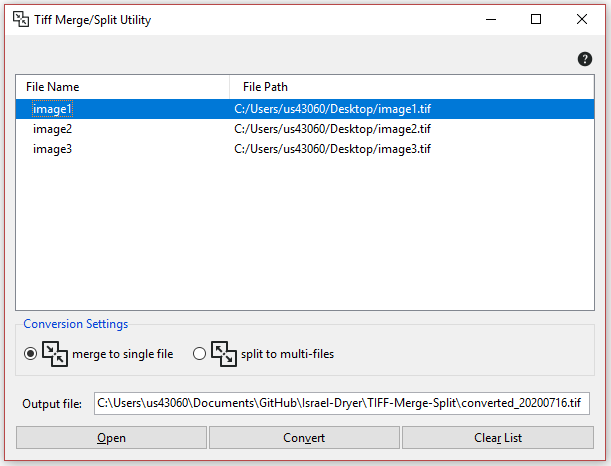

# TIFF-Merge-Split
A simple utility for merging and splitting TIFF files.  

## Merging multiple TIFF files into a single TIFF file
- Click **[Open]** and select the files that you wish to merge into a single TIFF file.
- Select the **[merge to single file]** option in the “Conversion Settings”.
- Enter an Output file name. By default, the program uses the file name _converted_YYYYMMDD.tif_ and saves to the current working directory.
- Click **[Convert]** to merge and save all selected images.
## Splitting a TIFF file into multiple images
- Click **[Open]** and select a single file that you wish to split to multiple TIFF files.
- Select the **[split to multi-files]** option in the “Conversion Settings”.
- Click **[Convert]** to split the TIFF file into multiple images.  

NOTE: The split images will output to the same directory as the source image and will add the suffix “_0.tif”, “_1.tif”, etc.  

## Arrange files  
You may want to save the files in a different order. You can manipulate the row order by clicking on row and pressing the **[page up]** or **[page down]** buttons on your keyboard to move the row up or down in the list. You can also press the **[delete]** button on your keyboard to remove the row altogether.  

## Starting over
Click the **[Clear List]** button to remove all rows from the list and start again.  

## Non-standard dependencies
The following libraries will need to be installed via pip or conda in order to run the program:
- pillow  `pip install pillow`
- libtiff `pip install libtiff`
